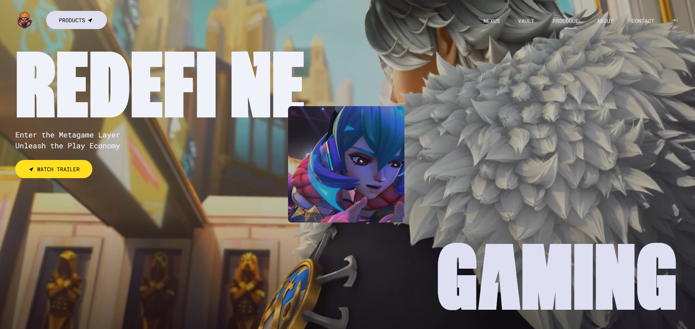
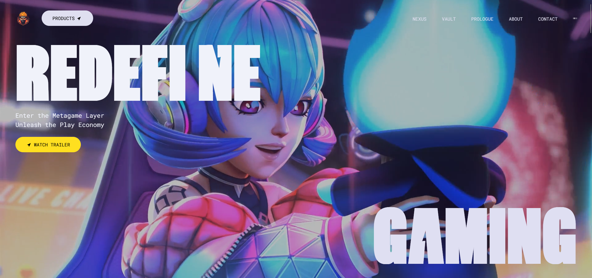
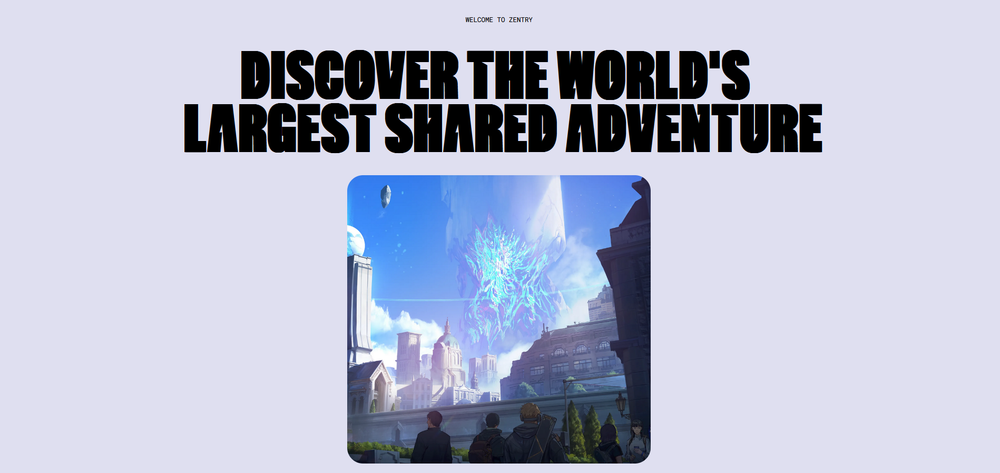
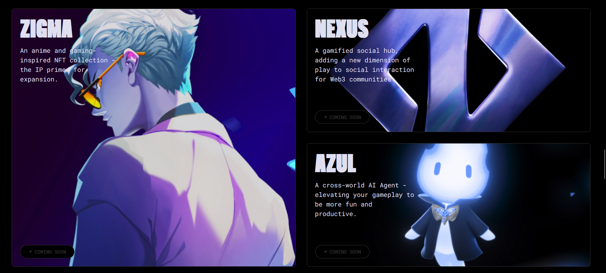
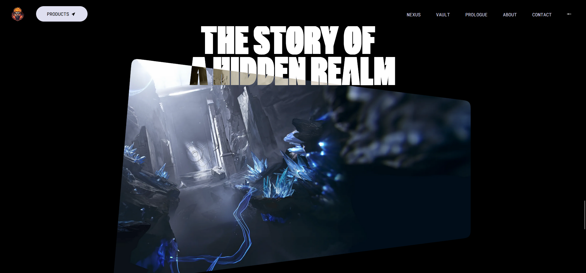
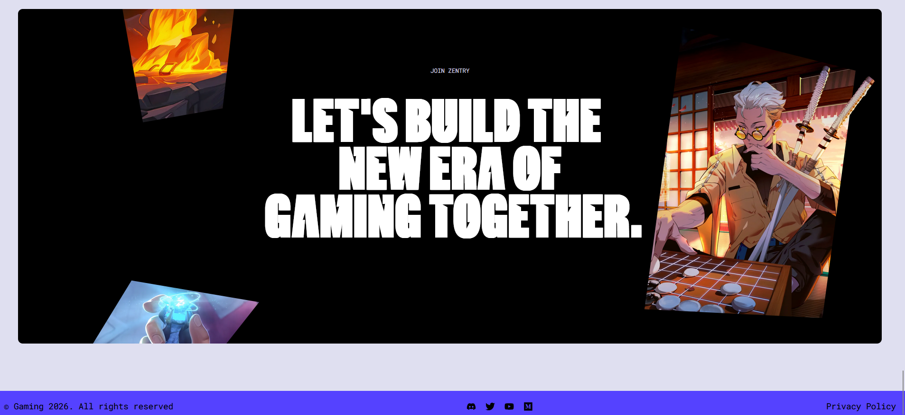

# Anime Website

A modern, high-performance web application built with **React 19** and **Vite**, featuring stunning animations and a premium user experience. This project leverages the power of **GSAP** for complex animations and **Tailwind CSS** for rapid, responsive styling .

##  Tech Stack

This project is built using the following technologies and libraries :

### Core
- **[React](https://react.dev/)** (v19): A JavaScript library for building user interfaces.
- **[Vite](https://vitejs.dev/)** (v7): Next Generation Frontend Tooling for fast development and building.

### Styling
- **[Tailwind CSS](https://tailwindcss.com/)** (v4): A utility-first CSS framework for rapidly building modern designs.
- **[clsx](https://github.com/lukeed/clsx)**: A tiny utility for constructing `className` strings conditionally.

### Animations & UI
- **[GSAP](https://gsap.com/)** (v3): GreenSock Animation Platform for high-performance animations.
- **[@gsap/react](https://gsap.com/resources/React/)**: A dedicated hook for using GSAP in React safe and efficiently.
- **[React Icons](https://react-icons.github.io/react-icons/)**: Include popular icons in your React projects easily.
- **[Lenis](https://lenis.darkroom.engineering/)**: A lightweight and robust smooth scrolling library.

### Utilities
- **[react-use](https://github.com/streamich/react-use)**: A collection of essential React Hooks.

##  Installation & Setup

Follow these steps to get the project running on your local machine:

1.  **Clone the repository** (if applicable) or navigate to the project folder:
    ```bash
    cd anime
    ```

2.  **Install dependencies**:
    ```bash
    npm install
    ```

3.  **Run the development server**:
    ```bash
    npm run dev
    ```

4.  **Build for production**:
    ```bash
    npm run build
    ```

##  Key Features

- **Modern Architecture**: Built on React 19 and Vite for blazing speed.
- **Bento Grid Layout**: A sophisticated Bento-style grid layout for organizing content with interactive 3D tilt effects.
- **Advanced GSAP Animations**:
    - **Dynamic Titling**: Custom GSAP animations for captivating text reveals and title effects.
    - **Video Frame Transitions**: Seamless animations transforming video frames from small previews to immersive full-screen experiences.
    - **Scroll-Triggered Effects**: Complex timeline-based animations synchronized with user scrolling.
- **Smooth Scrolling**: Integrated `lenis` for a premium, buttery-smooth scroll experience.
- **Immersive Audio**: Featured background music and audio effects with a control toggle located at the top right for a complete sensory experience.
- **Responsive Design**: Fully responsive layout using Tailwind CSS v4, ensuring a flawless look on any device.

## Project Gallery

Here's a glimpse of the application's design and features:

| | |
|:-------------------------:|:-------------------------:|
|  |  |
|  |  |
|  |  |


##  Project Structure

```
anime/
├── src/
│   ├── components/       # Reusable UI components (Hero, Features, etc.)
│   ├── App.jsx           # Main application component
│   └── main.jsx          # Entry point
├── public/               # Static assets
└── package.json          # Project dependencies and scripts
```

##  Scripts

- `npm run dev`: Starts the development server.
- `npm run build`: Builds the app for production.
- `npm run lint`: Runs ESLint to check for code quality issues.
- `npm run preview`: Locally preview the production build.
